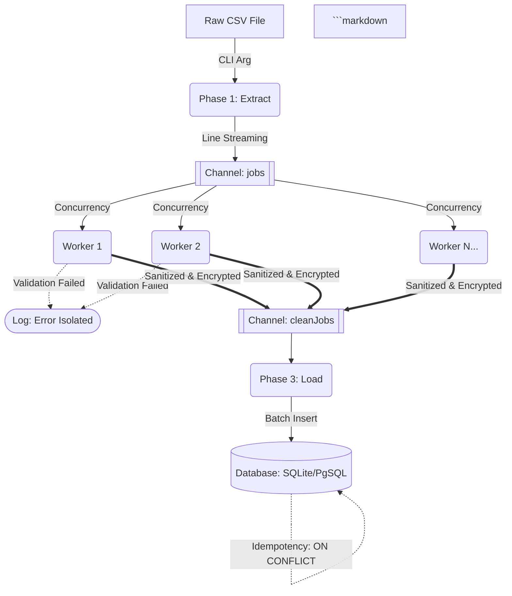

# AegisStream: Concurrent Retail ETL Pipeline

 

A highly concurrent, secure, and resilient Extract, Transform, Load (ETL) pipeline written in Go. Designed to process massive retail transactional data files with a strictly controlled (flat) memory footprint via **Worker Pools** and **Idempotent Batch Inserts**.

## 1. The Engineering Problem

In large-scale retail operations, traditional ETL architectures fail when processing massive end-of-day reconciliation files:
1. **Memory Exhaustion (OOM):** Loading entire multi-gigabyte CSV files into RAM crashes the server.
2. **CPU/Network Bottlenecks:** Sequential data processing and line-by-line database insertions cause internal Denial of Service (DoS) and sluggish performance.
3. **Data Compliance:** Storing raw PII (Personally Identifiable Information) violates data protection laws (e.g., LGPD/GDPR).

## 2. The Architecture Solution

AegisStream solves this by implementing a channel-based concurrent architecture to isolate the ingestion, transformation, and persistence phases.

    Key Engineering Decisions:
Streaming Extraction: The file is read line-by-line (encoding/csv). The application's memory footprint is bound only to the line currently in transit, allowing infinite file processing.

Worker Pool Transformation: Goroutines consume the data queue and apply business rules concurrently, maximizing CPU core utilization. Malformed data is caught and logged without breaking the pipeline.

Security (AES-256) & Sanitization: Sensitive data (like National IDs) are either masked for analytics or encrypted (AES-256-GCM) before reaching the database, ensuring compliance with data protection laws.

Idempotent Batch Loading: Sanitized records are buffered in memory and persisted in batches. UPSERT commands (ON CONFLICT DO UPDATE) ensure data integrity and prevent financial duplication upon file reprocessing.

Resiliency & Graceful Shutdown: Implements Exponential Backoff retry logic for database operations and intercepts OS signals (SIGTERM/SIGINT) to prevent data corruption during unexpected shutdowns.

3. How to Run Locally
This project was built to be tested immediately with zero external dependencies. It automatically generates a local SQLite database upon first execution.

Bash
git clone https://github.com/SanjiTriste/AegisStream.git
cd AegisStream
go run cmd/etl/main.go -csv=inbox/vendas_reais.csv

AegisStream: Pipeline ETL Concorrente para o Varejo (Português)
Um motor de extração, transformação e carregamento (ETL) altamente concorrente, seguro e resiliente escrito em Go. Projetado para processar arquivos transacionais massivos do varejo com consumo de memória estritamente controlado (flat memory footprint) usando Worker Pools e Batch Inserts Idempotentes.

1. O Problema de Engenharia
Em operações de varejo de grande escala, arquiteturas ETL tradicionais falham ao processar arquivos de conciliação de fechamento de caixa:

Falta de Memória (OOM): Tentar carregar CSVs multi-gigabytes na RAM derruba o servidor.

Gargalos de CPU/Rede: Processar e inserir no banco linha por linha cria gargalos sequenciais e DoS interno.

Compliance de Dados: Armazenar dados sensíveis brutos (como CPFs) viola as leis de proteção de dados (LGPD).

2. A Solução (Arquitetura)
O AegisStream resolve isso adotando uma arquitetura concorrente baseada em canais (channels) para isolar as fases de ingestão, transformação e persistência (Vide diagrama acima).

Decisões de Engenharia Principais:
Extract via Streaming: O arquivo é lido linha a linha. A memória consumida é apenas a da linha atual em trânsito, permitindo processar arquivos infinitos.

Transform via Worker Pool: Goroutines consomem a fila de dados e aplicam as regras de negócio em paralelo, utilizando a CPU ao máximo. Falhas são isoladas e não interrompem o pipeline.

Segurança (AES-256) e Mascaramento: Dados sensíveis são mascarados para analytics ou criptografados (AES-256-GCM) antes de chegarem ao banco, garantindo aderência à LGPD.

Load via Batching e Idempotência: Registros são agrupados e inseridos em lotes. Comandos de UPSERT (ON CONFLICT) garantem a integridade dos dados e evitam duplicação financeira.

Resiliência e Graceful Shutdown: Implementa lógica de Retry com Exponential Backoff para o banco de dados e interceptação de sinais do SO (SIGTERM/SIGINT) para impedir corrupção de lotes em trânsito.

3. Como Executar Localmente
Este projeto foi construído para ser testado imediatamente, sem dependências externas complexas. Ele gera um banco de dados SQLite local na primeira execução.

Bash
git clone https://github.com/SanjiTriste/AegisStream.git
cd AegisStream
go run cmd/etl/main.go -csv=inbox/vendas_reais.csv

Após colar isso e atualizar no GitHub, o seu repositório estará esteticamente e tecnicamente impecável. Bom descanso! Você construiu uma arquitetura incrível hoje.